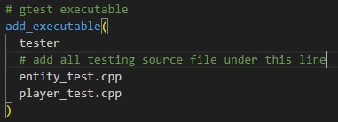

# AttackGame

## What is this?
User must defeat 10 monsters, each in increasing power and abilities.

## Purpose
Learn C++:
- apply OOP concepts
- unit testing ([googletest](https://github.com/google/googletest/tree/main))
- basic automated GitHub testing (using Action)

## Libraries
- [nlohmann/json](https://github.com/nlohmann/json)

## build and run
### pre-req (as tested):
  - Ubuntu 22.04.3 LTS (on WSL)
  - [cmake](https://cmake.org/)
  - [make](https://man7.org/linux/man-pages/man1/make.1.html)

### build
1. Generate build: In `root` of project, run `cmake . -B build`, which sources from current dir (`.`) and output build to `build` directory
2. Build: `cmake --build build`

### run
#### run unit test ([reference](http://google.github.io/googletest/quickstart-cmake.html#create-and-run-a-binary))
1. write the tester source code and add to the list of source to be compiled in `CMakeList.txt` under `add_executable` like so:\
 
2. compile and build your tester from [above](#build)
3. Run `./build/tester`. Gtest should've discovers the new source and run all tests compiled